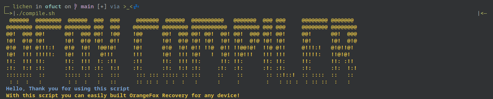

# OrangeFox For your Device

---



# Automate the compile processes.

1. Make sure you know what your doing [OFox Wiki](https://wiki.orangefox.tech/en/dev/building)
2. Clone this repo to ~/ofuct/
3. Run this script.
4. Follow the steps.
5. Compile OrangeFox Recovery 🦊
---

Edit BoardConfig.mk

```sh
TW_INCLUDE_REPACKTOOLS := false
```

---

> ### Credits
-  [@Rustmilian](https://github.com/Rustmilian)
